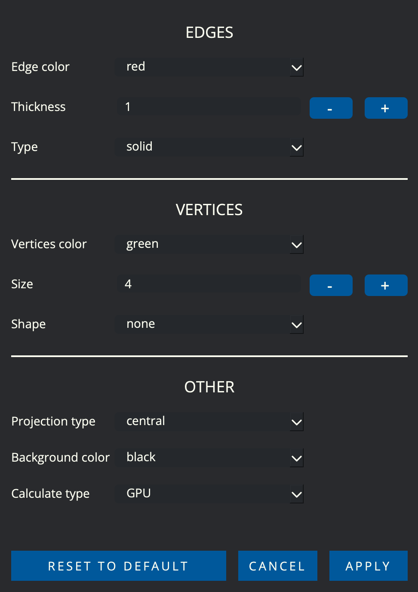

HOW TO BUILD:
=============================
#### Can be opened in Qt creator and build.

# DOCUMENTATION 3D_VIEWER
    
## LET'S GO!
    
3D_VIEWER - is an application that allows you to view 3D models in parallel and central projection.
    
#### BASIC APP FUNCTIONS:
    
        
- Window for selecting the name of the .obj file
        
- Object translate by Ox, Oy, Oz
        
- Object rotation by Ox, Oy, Oz
        
- Object approximation by Ox, Oy, Oz
        
- Model information: number of points and edges
        
- Editor settings
        
- Take a screenshot
        
- Make a GIF
    
##### Dragon.obj
    
#### HOW TO USE:
    
        
- To choose a model, you need to add or select it
        
- For the model to appear on the screen, press the "CHOOSE FILE" button
        
- To move, rotate and scale the model, you need to enter a value in the box and click on the
                "TRANSLATE", "ROTATE", "SCALE" buttons
            
        
- To move, rotate and scale the model, you need to move the slider to the desired distance
        
- To change the settings, you need to click on the button "SETTING"
    
    
#### RECOMENDATION:
    
        
- There may be problems with rotation in a circle in the axis, due to the fact that all transformations are
                carried out with matrices.
        
- Don't use large files. Up to 3 Mb.
        
- Set correct moving, rotate, and scale values. Example: "10-90-10".
    
    
### LET'S TALK ABOUT SETTING
    
Setting - This is a feature of the editor that allows you to customize it.

    
#### BASIC SETTING:
    
        
- Selecting edge color
        
- Selecting edge thickness
        
- Selecting edge type: dotted or solid
        
- Selecting vertices color
        
- Selecting vertices size
        
- Selecting vertices shape
        
- Selecting projection type: central or parallel
        
- Selecting background color
        
- Selecting calculate type models: GPU or CPU
        
- Choose button RESET TO DEFAULT will return the original settings
        
- Choose button CANCEL will cansel choose setting
        
- Choose button APPLY will apply choose setting
    
    
#### TYPES OF PROJECTION:
    
        
- "The Parallel projection" - the type of projection that uses parallel projecting rays
        
- "The Central projection" - of a point is the point of intersection of the projecting line passing
                through the projection center and the projection object (point) with the projection plane
    
    
#### RECOMENDATION:
    
        
- Maximum thickness or size values 10
        
- Don't move the mouse when choosing a value
    
    
<h7>BY STUDENTS OF 21 SCHOOL</h7>

